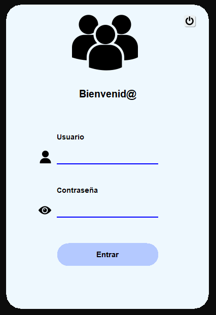
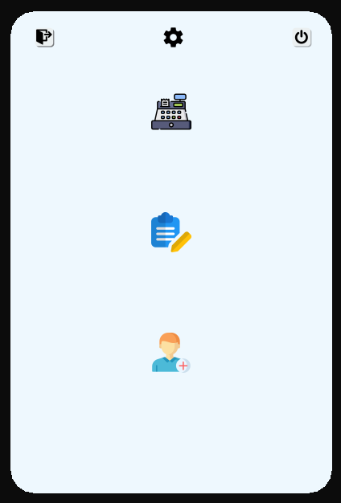
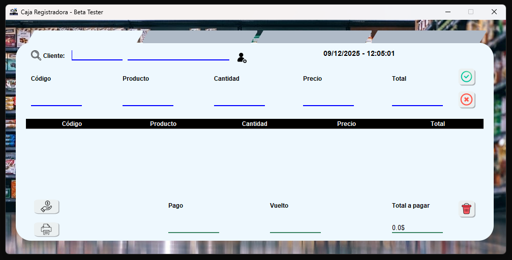
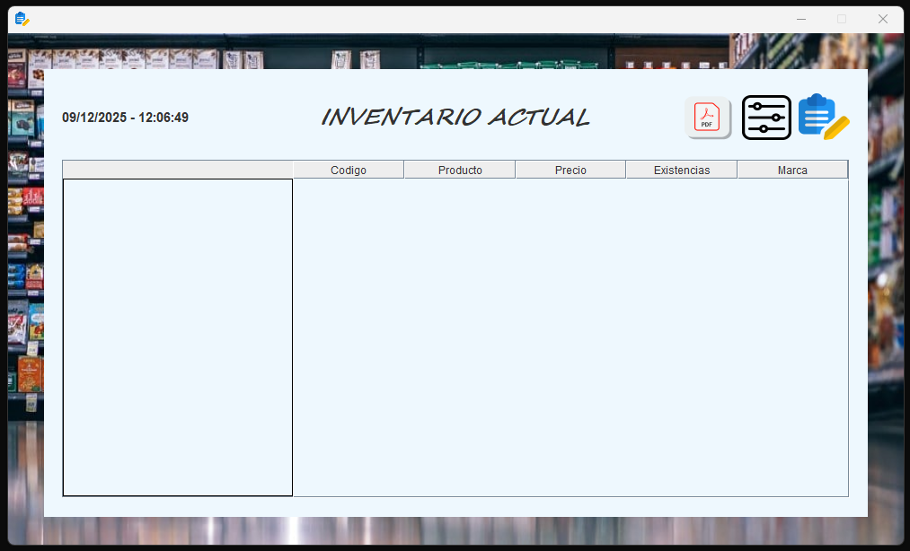
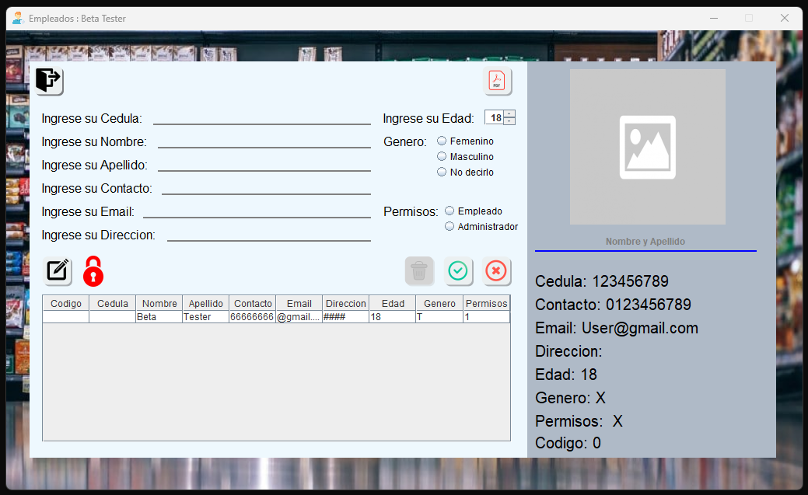

# Cashier System - Sistema de Gestión de Ventas


Sistema de punto de venta completo desarrollado en Java con interfaz gráfica Swing, base 
de datos SQLite y herramienta de construcción Ant. Diseñado para pequeñas y medianas 
empresas que necesitan gestionar ventas, inventario y usuarios de manera eficiente.

## ✨ Características Principales

### 📦 Gestión de Inventario
- Registro de productos con código, nombre, categoría, precio y stock
- Historial de movimientos de inventario

### 👥 Gestión de Usuarios
- Sistema de roles (Administrador, Cajero, etc)
- Control de acceso por permisos

### 💰 Sistema de Ventas
- Interfaz de caja intuitiva con carrito de compras
- Cálculo automático de totales, impuestos y descuentos
- Generación de tickets de venta
- Historial de ventas con filtros por fecha

## 🛠️ Tecnologías Utilizadas

- **Java SE 17** - Lenguaje de programación principal
- **Apache Ant 1.10+** - Herramienta de construcción
- **SQLite 3** - Base de datos embebida
- **JDBC** - Conexión a base de datos

## 📋 Prerrequisitos

- Java JDK 17 o superior
- Apache Ant 1.10 o superior
- SQLite 3 (incluido en el proyecto)
- Sistema operativo: Windows, Linux o macOS

## 🖥️ Capturas de Pantalla

<div align="center"> <h3>Interfaz Principal de la Aplicación</h3> <table> <tr> <td align="center"> <strong>Pantalla de Login</strong><br> <br> <em>Interfaz de autenticación de usuarios</em> </td> <td align="center"> <strong>Dashboard Principal</strong><br> <br> <em>Panel de control con resúmenes</em> </td> </tr> <tr> <td align="center"> <strong>Punto de Venta</strong><br> <br> <em>Interfaz de caja registradora</em> </td> <td align="center"> <strong>Gestión de Productos</strong><br> <br> <em>CRUD completo de inventario</em> </td> </tr> <tr> <td align="center"> <strong>Reportes y Estadísticas</strong><br> <br> <em>Visualización de datos de ventas</em> </td> <td align="center"> <strong>Gestión de Usuarios</strong><br> <br> <em>Administración de roles y permisos</em> </td> </tr> </table> <p><em>Nota: Reemplazar estas imágenes de placeholder con capturas reales de la aplicación</em></p> </div>

## 🚀 Instalación y Configuración

### 1. Clonar el repositorio
```bash
git clone https://github.com/MaySalguedo/CashierSystem.git
cd CashierSystem